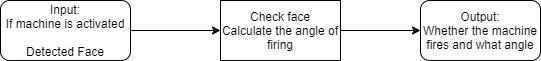
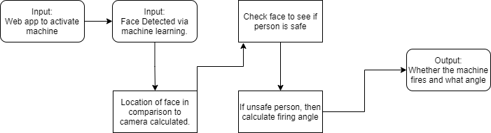

# **Table Of Contents**

**[Abstract](#_8a5q7d9g9nz8) 2**

**[Project Description](#_ibteshdgfniw) 2**

**[User Stories](#_fg1l6lfwukro) 3**

**[Design Diagrams](#_a2ire4azauss) 3**

[Level 0](#_el4vef2xp2fy) 3

[Level 1](#_assmp7r476al) 3

[Level 2](#_psatfmafy69k) 4

**[Project Tasks and Timeline](#_ccgnt6w6re0s) 6**

[Task List](#_hml5fks6xdzu) 6

[Timeline](#_i17lm3t0bad4) 7

[Effort Matrix](#_s7h0xf694x2p) 8

**[PPT Slideshow](#_4rxfwf3mpqrt) 9**

**[Self-Assessment Essays](#_l5g13m2ea8yi) 9**

[Andrew Dygert](#_fv8grnfl32gt) 9

[Austen Brownfield](#_bplthp8lqakq) 10

[Fred Jenks](#_18vmihego6z2) 11

[Jared Musser](#_azi8s4nthj18) 13

**[Professional Biographies](#_7zsine9mfmv1) 14**

[Andrew Dygert](#_daz2g34lfzxb) 14

[Austen Brownfield](#_9rsxk3x4qt72) 15

[Fred Jenks](#_82sqbtqr0ic3) 16

[Jared Musser](#_rt2wa1ihpc1w) 17

**[Budget](#_r7nckih3qy4t) 18**

**[Appendix](#_u9n9ofl8dev4) 18**

# Abstract

Personal security is a major issue during these times. Individuals shouldn&#39;t need to worry about the safety of their personal belongings while he or she isn&#39;t there to ensure their safety. Our team has decided to pursue the research and development of a project that seeks to remedy this issue: an automated nerf gun that fires upon trespassers. No longer will people be worried about the safety of their belongings when this device is in use. While this device is on and in a room, should a trespasser be detected (either by facial recognition via a camera or a tripped motion sensor), the nerf gun will fire at them. The sudden confusion and fear of being shot at by a nerf gun will scare away any unwanted guests.

# Project Description

While most people lock the doors in and out of their house, how many individuals lock additional doors within their house while they&#39;re away? Should an intruder get past the first line of defense, then an individual&#39;s belongings are at risk unless there are additional countermeasures. Individuals could purchase costly security measures, but where&#39;s the fun in that? An automated nerf gun turret would be an inexpensive, secure, and fun option for individuals to consider.

If the nerf gun were to fire at trespassers via facial detection, a machine learning solution will need to be implemented to correctly identify the faces of these individuals. Should a motion sensor instead be used to detect the movement of unwanted individuals, a solution that listens to signals from this device will need to be created. A physical track may be developed to allow the movement/rotation of the nerf gun, and some device to pull the nerf gun&#39;s trigger will also need to be created as well. The solutions to these problems will involve programming as well as the construction of these devices.

Our team proposes to construct this automatic nerf gun turret. This turret will fire upon individuals who trespass into the room it&#39;s set up in. The different means by which the turret could fire (facial recognition or motion detection) will be researched to determine the best solution. Our team is composed of individuals studying computer science, so we&#39;re all familiar and proficient with the topic of programming and software development. The development of the physical aspect of this project, such as a track, will require research to identify unique solutions

# User Stories

- As a homeowner, I want this automated nerf gun turret to fire when trespassers enter a protected room, so that the intruder will retreat and that my items will be safe.
- As a user of this device, I want the automated nerf gun turret to fire at the intruder once he/she has been identified via facial recognition or motion detection, so that the intruder will retreat and that my items will be safe.
- As a user of this device, I want to be able to view the video feed of the attached camera to the nerf gun turret, so that I can personally view the room that it&#39;s protecting.
- As a user of this device, I want there to be adjustable legs so that the turret can adjust to different environments.
- As a user of this device, I would like a remote activation feature so that I can make sure that it is always on when I need it to be.

# Design Diagrams

## Level 0

The above image represents the lowest level design of our project. The user will activate the machine. If a face is detected, the firing angle is calculated and the nerf gun turret fires.

## Level 1

The user uses a web app that turns on the camera and arms the device. The camera then detects a face through machine learning training. If the person isn&#39;t directly in front of the camera, the angle is calculated and the nerf gun is rotated to the correct position to fire. If the person is identified as unsafe, they are shot by the nerf gun.

## Level 2

The web app will have authentication to make sure that only certain users can access the app and activate the turret. A machine learning model will be trained for facial recognition. The current assumption is that there will be a free, publicly available dataset of faces to use for training. If not, the collection of images of faces to train and test the model with will be more tedious to produce. At this stage of development, we are also unsure of what type of machine learning model will be used for this task.

We plan to use pi cam (raspberry pi) as the camera: this device records video at 1080p 30 fps. Frames will be examined for the presence of a face. It will likely be computationally expensive to check every frame for this, so we will need to test and decide how many frames to ignore before checking a frame for facial detection.

Once a face is detected, the location of the person in comparison to the camera is calculated. This calculation is necessary as (obviously) the nerf gun will likely need to rotate to point at the target. At this stage of development, we plan to use a servo motor to do this. The output (a boolean value) is determined by whether or not the detected individual is unsafe. This value will represent whether or not the nerf gun should fire. An individual is defined as unsafe based on whether or not that individual&#39;s face has been recorded in our system. If he/she is identified as unsafe, the turret will fire at them. If the gun needs to be rotated it will rotate as the gun is firing.

# Project Tasks and Timeline

## Task List

1. Research the most efficient machine learning model to implement facial recognition.
2. Investigate the existence of an available dataset of faces to train a machine learning model.
3. If a neural network is decided as the machine learning model, investigate the most efficient number of layers and neurons to use.
4. Develop software that identifies safe and hostile users based on camera frames and a database of faces.
5. Develop a program to read the data from the camera
6. Develop a program to take the data read from the camera and feed it to the facial recognition software.
7. Research what language would work best for our project.
8. Design the stand for the turret.
9. Design the trigger pull system.
10. Design the hardware components of the aiming system.
11. Implement the calculations for the aiming system
12. Acquire a nerf gun.
13. Acquire Raspberry Pi, Pi Cam, and motors.
14. Build the turret.
15. Test the rotation system with the nerf gun mounted.
16. Test the trigger pull system.
17. Test the aiming system.
18. Test and validate the facial recognition system.
19. Document the software aspects.
20. Document the hardware aspects.
21. Design/Develop the web app.
22. Investigate which framework to use for the development of the web app
23. Investigation of how best to build the database.
24. Build the database.
25. Implement a user login system to activate the turret.

## Timeline

| Task # | Start Date | Completion Date | Milestone | Primary Responsibility | Completed |
| --- | --- | --- | --- | --- | --- |
| 1 | 12/11/2021 | 12/17/2021 | 1 | Austen |
 |
| 2 | 12/18/2021 | 12/24/2021 | 1 | Austen |
 |
| 3 | 12/25/2021 | 12/31/2021 | 1 | Austen |
 |
| 4 | 2/14/2022 | 3/1/2022 | 9 | Austen/Andrew |
 |
| 5 | 11/12/2021 | 12/31/2021 | 4 | Andrew |
 |
| 6 | 11/12/2021 | 12/31/2021 | 4 | Andrew |
 |
| 7 | 10/11/2021 | 11/11/2021 | 4 | Andrew | yes |
| 8 | 10/12/2021 | 11/6/2021 | 2 | Fred/Jared |
 |
| 9 | 10/12/2021 | 11/6/2021 | 2 | Fred/Jared |
 |
| 10 | 10/12/2021 | 11/6/2021 | 2 | Fred/Jared |
 |
| 11 | 1/31/2022 | 2/14/2022 | 7 | Austen/Andrew |
 |
| 12 | 10/11/2021 | 11/11/2021 | 3 | Jared | yes |
| 13 | 10/11/2021 | 11/11/2021 | 3 | Jared | yes |
| 14 | 11/12/2021 | 1/31/2022 | 5 | Fred/Jared |
 |
| 15 | 2/14/2022 | 2/22/2022 | 7 | All |
 |
| 16 | 2/14/2022 | 2/22/2022 | 7 | All |
 |
| 17 | 2/14/2022 | 2/22/2022 | 7 | All |
 |
| 18 | 2/23/2022 | 3/1/2022 | 9 | All |
 |
| 19 | 11/12/2021 | 4/1/2022 | 10 | Andrew |
 |
| 20 | 11/6/2021 | 11/11/2021 | 2 | Fred |
 |
| 21 | 12/6/2021 | 12/13/2021 | 6 | Andrew/Fred |
 |
| 22 | 11/28/2021 | 12/05/2021 | 6 | Fred/Austen |
 |
| 23 | 12/14/2021 | 2/14/2022 | 8 | Jared |
 |
| 24 | 12/14/2021 | 2/14/2022 | 8 | Jared |
 |
| 25 | 12/6/2021 | 12/13/2021 | 6 | Fred |
 |

## Effort Matrix

| Task | Andrew | Austen | Fred | Jared |
 |
| --- | --- | --- | --- | --- | --- |
| 1 | 15% | 75% | 5% | 5% | 100% |
| 2 | 15% | 75% | 5% | 5% | 100% |
| 3 | 15% | 75% | 5% | 5% | 100% |
| 4 | 15% | 75% | 5% | 5% | 100% |
| 5 | 75% | 15% | 5% | 5% | 100% |
| 6 | 75% | 15% | 5% | 5% | 100% |
| 7 | 75% | 15% | 5% | 5% | 100% |
| 8 | 5% | 5% | 45% | 45% | 100% |
| 9 | 5% | 5% | 45% | 45% | 100% |
| 10 | 5% | 5% | 45% | 45% | 100% |
| 11 | 85% | 5% | 5% | 5% | 100% |
| 12 | 0% | 0% | 0% | 100% | 100% |
| 13 | 5% | 5% | 5% | 85% | 100% |
| 14 | 5% | 5% | 45% | 45% | 100% |
| 15 | 25% | 25% | 25% | 25% | 100% |
| 16 | 25% | 25% | 25% | 25% | 100% |
| 17 | 25% | 25% | 25% | 25% | 100% |
| 18 | 25% | 25% | 25% | 25% | 100% |
| 19 | 45% | 45% | 5% | 5% | 100% |
| 20 | 5% | 5% | 85% | 5% | 100% |
| 21 | 45% | 5% | 45% | 5% | 100% |
| 22 | 45% | 5% | 45% | 5% | 100% |
| 23 | 5% | 5% | 5% | 85% | 100% |
| 24 | 5% | 15% | 5% | 75% | 100% |
| 25 | 5% | 5% | 85% | 5% | 100% |
|
 | 6.5 | 5.6 | 6 | 6.9 |
 |

# PPT Slideshow

[Senior Design Presentation](https://docs.google.com/presentation/d/1mJ0LD__Zt9PbR_O5_9Xch92pF-ySwD1Ky3mfNQfL1IM/edit?usp=sharing)

# Self-Assessment Essays

## Andrew Dygert

The project that I will be working on is a nerf gun turret that will fire upon an individual in the appropriate circumstances. We plan to use a multitude of technologies to identify when the individual should be fired upon. These technologies include face recognition technology or some alternative to determine who is not a &quot;threat&quot;. There will also need to be a raspberry pi or some alternate so that we can program the machine. There is also the need for a mechanism that first the gun that will need to be fired. Lastly, there will need to be some override mechanic in case of a malfunction.

There are a few classes that will have taught us some things that we are going to need for this project. MATH1062 (Calculus II) and AP Physics C are going to be useful to do the calculations. In CS3003 (Programming Languages) we did some work with raspberry pi, which will be helpful, as well as some basic programming languages. In CS2028C (Data Structures), we learned about data structures that may be needed for this project. EECE3039C (Software Engineering) will also be very useful as a skill to help develop the software for the nerf turret. CS4033 (AI Principles and Applications) are also useful since it will be an AI firing and aiming the turret.

In my first co-op, I was a web developer for Learn 21. On my second co-op I was again a web developer, but with American Financial Group. My third co-op was with Cintas as a Data Analyst. These co-ops firstly taught me how to work well with a team, even if you are just meeting them for the first time. The first two web developer co-ops also taught me some SQL, which may be needed for this project. Lastly, my third co-op taught me machine learning, which may also be needed for this project.

I am excited about this project for several reasons. Firstly, this is the first major project I have been on that has a robotic element to it. I am also excited to use some facial recognition software, which seems to be more popular over time. I do believe our preliminary approach to the project will include some sort of facial recognition to identify people. I will also need some sort of robotic turret that can rotate, and angle up or down as needed. Then, depending on the results of the facial scan, it will decide whether to fire the nerf gun.

I expect that the nerf gun will be able to be fired with very good accuracy, especially from the range close enough to where the facial scan will have to take place. I believe that we can get the facial scan to work will. I am also worried about how precise robotics need to be, and if we can build them accordingly. I will evaluate my contributions, not only by the time I spend but by how much of that time I am getting quality work done and advancing our group towards our goal. We will know we are done when all parts are working, the firing of the gun is accurate, and the facial detection is also accurate. We will know whether we have done a good job is by how accurate the gun is, and how quick the gun is to fire.

## Austen Brownfield

The senior design project my group and I are currently expecting to research/build is a

nerf gun turret that will fire upon individuals in specific circumstances. These circumstances

include if the face of an individual is detected on a camera, or if a motion sensor is tripped. This

group consists of only computer science students, so I believe an area we&#39;re all strong in is

software development and programming. I believe this experience will allow us to successfully

develop software that can perform some of the necessary tasks for this project (e.g. use machine

learning to identify faces, control when the nerf gun fires, etc.). However, I believe my group and

I lack experience with physical hardware and devices, so some aspects of this idea (pulling the

trigger, creating/monitoring a motion sensor, etc.) may be difficult to implement.

I&#39;ve personally taken specific courses at this university that I think will provide a good

foundation for the experience/information needed to complete this project. I&#39;ve taken

MATH1062 (Calculus II), MATH2076 (Linear Algebra), CS4033 (AI Principles and

Applications), and CS5137 (Machine Learning). I believe, if my group were to implement some

form of machine learning for facial recognition, the knowledge I&#39;ve gained from these courses

will allow me to implement this. I&#39;ve also taken many programming courses such as

EECE3093C (Software Engineering), CS3003 (Programming Languages), CS2021 (Python

Programming). I think these courses gave me the necessary experience I&#39;ll need to create and

implement code for this project. I&#39;ve also picked up skills and experience from my coops.

I worked at the tech company London Computer Systems for four semesters. My position

was that of a quality assurance software tester for one semester. During this time, I discovered

and reported defects to my team, coordinated with software developers to verify code changes

had addressed certain issues, and was responsible for creating and executing test cases. I was a

software developer for the other three semesters of my coop. In this position, I reviewed software

changes made by others to ensure program quality and designed, developed, and implemented

code changes to software. I also gained experience working with a team of competent software

developers. I believe my time spent on coop provided me with efficient software development

skills and practices as well as good testing habits that will allow me and my team to competently

work on and complete this project.

I&#39;m excited to work on this project for several reasons. The first of which is that I feel

like this is the best opportunity I&#39;ll have at university to create something that not only am I

proud of, but something my friends and family can be proud of too. This project could be a neat

feather in my cap that tells others I learned something at school and made something awesome

with it. Secondly, I think this project idea is difficult enough that my team and I can pick up new

skills along the way. For example, like I said earlier, I feel the software aspect of this project

won&#39;t be too difficult, but the hardware aspect (pulling the nerf gun trigger, creating/monitoring a

motion sensor, etc.) is something I do not know very well at all. However, I think researching

this and coming up with our own solutions will be a great opportunity to learn about subjects that

weren&#39;t present in our traditional CS curriculum. I think our preliminary approach to this project

will be deciding what aspects of this are absolutely necessary to include and which aspects

aren&#39;t. For example, should we design and build a track that moves and adjusts the angle of the

nerf gun depending on the position of whoever is spotted on camera? If so, how will that be done

and can it be done in an efficient way that won&#39;t take months to complete? Otherwise, let&#39;s adjust

the parameters of our project so we don&#39;t need to implement the track specifically and can

instead focus on the bigger picture.

At this point, the only expected result that I wish for this project is that the nerf gun will

fire when someone has been detected via facial recognition or a motion sensor being tripped. I&#39;m

not sure of the smaller, more specific results that I wish to see since my group and I haven&#39;t

discussed them yet. I&#39;ll personally evaluate my contributions by objective metrics such as the

total amount of time I spent working on this project and how many lines of code I&#39;ve written. I&#39;ll

use more subjective metrics such as how often I was able to successfully help group members

complete their work, or how others feel and view our project as time progresses too. Besides the

obvious deadline date, my group and I will know when we&#39;re done once the project has

successfully completed the goals we set for it. If our project can do that, and it was able to do

that with little sacrifice to what we originally wanted to do, then I would feel that I had done a

good job creating this project

## Fred Jenks

Our planned project involves using facial recognition and motion tracking to create a sort of automated defense system. We plan to write a program that takes one or more camera feeds as input. When the program &quot;spots&quot; a face that is not authorized, it will fire at that face. As for the physical aspect, we plan to use a nerf gun and a set of motors to aim and fire it. The facial recognition will likely utilize machine learning to train the program to tell what is a face and what isn&#39;t. If the facial recognition fails, we plan on using motion sensors as a backup. We want to combine these inputs, feed them to a program, and have it accurately determine if there is an unauthorized person approaching.

So far in our curriculum, we have had a couple classes that will assist us with this project. The biggest help will be from our Principles of A.I. class (CS 4033), as that will assist us with the machine learning knowledge that we will need to train the program. Hopefully, that knowledge will not be overly difficult to apply to facial recognition. Also helpful will be our Python Programming class (CS 2021), as the library we used for CS 4033 was in python so we will likely have to use it quite a bit. Finally, I think my current Requirements Engineering class (CS 5127) will be very helpful for us. Being able to accurately determine what we need to do will be very important for making sure this project gets done.

As for my co-op experiences, I&#39;m honestly not sure how much help they&#39;ll be. I spent my last four rotations as a C# Developer at Edaptive Computing, Inc. If our project ends up needing any work in C#, then I&#39;ll likely be able to handle it. In addition to the C# work I did, most of my projects involved webapp development, so HTML, JS, and a little bit of TypeScript towards the end. I also did some work in SQL, which we will likely need. Outside of coding, I worked in small agile teams, which meant that even as an intern I had responsibilities in our meetings, whether they be for peer review, sprint review, or sprint planning. I also did a lot of work on documentation for each of my projects, which has greatly improved my technical writing skills.

Our preliminary approach will be to build a sort of stand for the gun to sit on, which will hopefully be able to adjust itself to aim the weapon if we have time to implement aiming. We will also set up a network of cameras and motion sensors so that the turret knows if someone is approaching. We will also need a mechanism to pull the trigger. If we have time for aiming, we will use the sensors and a set of motors to aim the gun. Our expected result at the end is to have a functional turret that can detect a person approaching, and if their face is not recognized or authorized, then the gun will fire. I will evaluate myself based on if what I&#39;ve done has made major contributions to the project and if the project is a success. If both are true, I&#39;d consider it a job well done.

I am excited for this project for a few reasons. First and foremost, machine learning is a major thing right now, so doing as much work with it as possible is important in my opinion. Facial recognition is also big with a lot of companies right now, so learning how to do it would be helpful for job searches, on top of it being a very cool innovation. On top of the real world applications of our project, it sounded like a lot of fun to make. I expect to come out of this project with a much better knowledge of how machine learning and facial recognition work, as well as a strong understanding of how to set them up to live camera feeds and determine who it&#39;s seeing in real time. I also am excited to learn about all of the physical aspects, such as hooking up the motion sensors, building the stand, and setting up the motors to aim if time permits. This project sounded great to me when it was proposed by one of my groupmates, and I can&#39;t wait to get started.

## Jared Musser

Our proposed project is to build a nerf turret that utilizes facial recognition software that we develop. This system will &quot;spot&quot; a face that it doesn&#39;t recognize and will then fire at the unsuspecting victim. We all are computer science students so we all have sufficient programming knowledge and experience to write the software. I think we will learn applicable skills such as machine learning for facial recognition and different things related to pulling the trigger and controlling when the trigger gets pulled. We all may have a bit of a lack in the hardware department since we are all computer science, however I have used Raspberry Pis and Arduinos in a previous class as well as a club I was in that developed a high altitude balloon payload and mission and used both an Arduino and a Raspberry Pi for the payload. But I may have some knowledge on how to use these small PCB&#39;s to manage the physical system.

One of the main things that goes into getting this turret to work is a working AI that uses a camera input to determine if a person is recognized or not. I think the class CS 4033 AI: Principles and Applications will help with laying the groundwork for the AI as well as the dirty work of getting it to work. Another class that will be used is EECE 3093C Software Engineering. This class should be the guide to creating our software. A class that I&#39;m currently in I think could help, it is CS 5127 Requirements Engineering. It should provide some general understanding of the structure of our project and the way to tackle the problem we are trying to solve.

During my co-op I learned some skills that I think will come in handy during this project. Non-technical skills that I learned such as communication and leadership on a project will help move this project along well and will help with working with people on this project. I worked on an application essentially by myself. I was given a web that had the bare bones and I pretty much made the application. I think my knowledge from actually working will also help. In the technical sense I am a Microsoft Certified Professional in C#. I received this certificate after months of preparing for the exam. I think this could help with the back-end, dirty work of the application. In the web apps that I made on c-op C# was the dirty work of the application, the back-end code that manipulated data, connected to databases, and I think that could help me to make the dirty work or back-end stuff working. My co-op job was as a Web Developer. I worked at a small consulting company in West Chester called Fortech LLC.

I am excited about this project for a couple reasons. One of these reasons is that I am genuinely passionate about security. Not necessarily safety, but like security for our nation, my home, and my family. I think this project will give me just a small taste into developing security systems and solutions to potential safety and security issues. I plan on making my own things relating to this, but more complex and for various things. Another reason I am excited to work on this project is that it is going to be the thing I think I will remember the most from my classes and accomplishments while in college. This project can and will be something that I can be proud of, my teammates can be proud of, and our families can be proud of. I think these projects should have aspects of these things and should be fun and interesting for everyone involved as well. This will definitely be fun to build and test out and mess around with. The preliminary approach we have for this project is to determine everything we will need and won&#39;t need and what could potentially be cut from a final design to minimize cost and still make a good product.

My expectations for this project are that we are going to be able to detect an unknown face and fire the nerf gun. Specifics for each person that I hope to see are currently unknown as nothing in this regard has been discussed. I think I will be evaluating myself and contributions based on how much code I&#39;ve written, how much time I spent on the project, and how much of the physical turret is built and eventually functional. There may be things that I do in a subjective manner such as if I was able to help the rest of the group on their part of the code or in the case of the other turret builder how much we help each other in building it I guess. I may also evaluate how the rest of my group feels about their work and views the project and time and the project progress. I think using a date to say when something is done isn&#39;t a good way to say something is done. I think to say it is done means different things. It could be code without bugs, it could be when initial requirements are met, it could be a whole host of things. However, I think for us to say our project is done probably falls in line with the initial requirements being met. Once these requirements (or goals) are met and it is with as little as possible sacrifice from the original goal and is successfully working, we can say we did a good job and our project is complete.

# Professional Biographies

## Andrew Dygert

Bio:

I am a Computer Science major with 3 separate co-op experiences. In my first co-op, I had a great experience, was unfortunately only able to stay with them for a semester. My next co-op had a similar experience despite the first, even though the second company was much larger than the first. The co-op also came to an early end due to Covid-19. Also because of Covid, I was unable to find another co-op until the Summer of 2021 with Cintas. This was a completely new experience than the first two in both technologies and culture. It ended a little shorter than I would have liked, so I wasn&#39;t able to finish the last project I was working on. Outside of my jobs and classes, I do enjoy sports, listening to music, video games, and occasionally coding solutions to some (usually not so serious) problems I encounter in my life.

Contact Info:

- Email: [dygertaj@mail.uc.edu](mailto:dygertaj@mail.uc.edu)
- Phone: 513-255-3470

Co-op Experience

- Cintas
  - Intern, Sum. 2021
  - Data Analytics and Machine Learning
  - SQL
  - Used SAP technologies
  - Began project to help identify potential customers using machine learning
- American Financial Group
  - Intern, Fall 2019
  - Web Development in ASP.net
  - C#, JavaScript, HTML, CSS
  - Helped develop improvements to the company&#39;s internal website
- Learn21
  - Intern, Spring 2019a
  - Web Development in ASP.net
  - C#, JavaScript, HTML, CSS
  - Developed a website to track the application process for a client&#39;s school

## Austen Brownfield

**Contact Information**

- Email: [Brownfaw@mail.uc.edu](mailto:Brownfaw@mail.uc.edu)
- Phone: (614) 398-6430

**Co-op and other related experiences**

- Software Developer, London Computer Systems, Mason, Ohio. (3 semesters)
  - Reviewed code changes to ensure program quality
  - Designed, developed and implemented code changes to software
  - Experience collaborating with a team of software developers
  - Responsible for converting sections of desktop client to web application
  - Created code changes primarily for front-end of web application
- QA Software Tester, London Computer Systems, Mason, Ohio (1 semester)
  - Discovered and reported defects. Coordinated with software developers to verify code changes addressed software defects
  - Responsible for creating and executing test cases and regression testing.

**Skills/expertise areas**

- Programming: C++, Python, TypeScript
- Operating Systems: Windows
- Web Development: HTML, CSS, Angular
- Database Programming: SQL
- Software: Adobe Photoshop, Adobe Premiere, Microsoft Office Professional including Excel, Word and PowerPoint

**Areas of interest**

- Machine Learning
- Cyber Security
- Game Development
- Web Development

**Type of project sought:**

- Develop a game that utilizes machine learning to some extent.
- Implement machine learning to aid in some form of cyber security problems.
- Create a website that demonstrates potential usage of machine learning through practical examples.

## Fred Jenks

**Bio:**

I am a Computer Science major fresh off my 5th co-op term. I spent my first semester at Siemens, which didn&#39;t really go as planned. After that, I went to Edaptive Computing, Inc. for my last 4 semesters, as well as some part-time work there while I was in classes last fall. While there, I worked mostly on web apps, generally using C# with Entity Framework, JS, and HTML with a quick pit stop in a project using TypeScript and SQL and some work with CentOS 7 and Docker. Outside of work, I enjoy watching/playing sports(go Browns!), video games, listening to music, and working on computers.

**Contact Info:**

You can get to me by:

- Email: [jenksfc@mail.uc.edu](mailto:jenksfc@mail.uc.edu)
- Phone: 614-726-2426

**Co-op Experience:**

- Siemens Software, Inc
  - Intern, Spr. 2019
  - Angular, C#
  - Small Team Agile
- Edaptive Computing, Inc
  - Intern, Fall 2019, Sum 2020 - Sum 2021
  - C#, NodeJS, HTML, CSS, TypeScript, SQL, Linux Kernel
  - Small Team Agile
  - End User and Developer Documentation

**Projects Sought:**

- Web Development
- Game Development
- Machine Learning
- Preferably something cool

## Jared Musser

**Contact Information:**

- Email: [musserjl@mail.uc.edu](mailto:musserjl@mail.uc.edu)
- Phone: 513-315-4637

**Co-op Work Experience:**

- Web Developer, Fortech LLC, Jan. 2019-May 2019, Aug. 2019-Dec. 2019, May 2020-Aug. 2020, Jan. 2021-Aug. 2021

  - Used JavaScript, C#, HTML, CSS, and SQL to write web applications for customers and internal company uses.
  - I learned different JavaScript frameworks for this applications, namely react.js, node.js, and vue.js.
  - Database work included writing stored procedures, maintaining the server it was on, and writing complex SQL queries.
  - Most of my work was on my own and my own projects, however, I did get some help some of the semesters from senior developers when I needed it.
  - During the summer semester of 2020 (May to August of 2020) I got certified in C# by Microsoft.
  - The double rotation when I was working there for nearly 8 months, I was given a project where the groundwork was laid out and I wrote essentially the entire application minus a couple things. I did almost all the bug fixes that happened. Another co-op was tasked to help me with bug fixes and quick enhancements.
  - During that application I created a custom renderer that took data in as a parameter and created a custom way to put the data in a tree format.
  - I also learned the more complex technical side to vue during this project as well. I used vue previously, but not as in depth and complex as with this application.

**Skills:**

- C#, C++
- JavaScript, Vue
- Python
- HTML, CSS
- SQL

**Project Sought:**

- Game Development Related
- Web Development
- Maybe VR Simulation or something similar

# Budget

$100 - Test Guns and Darts

$135 - Raspberry Pi and other hardware

# Appendix

Proof of 45 hours

The effort matrix sums the contributions of each team member in regard to the total contributions. The lowest contribution among team members is 5.6 (~22%). The total number of days that make up the major tasks of this contribution are ~35. Assuming 1.5 hours of work are done each of these 35 days, this member will contribute 52.5 hours of work towards this project&#39;s completion. It&#39;s unrealistic that the upper bound of each group member&#39;s work for a day is 1.5 -- this total will likely be much higher. Also, when taking into account the activities that this group member isn&#39;t majorly contributing to, as well as the shared work of all tasks across this project among all team members, easily over 50 hours of work will be performed.

Assuming that this same calculation can be performed for each group member, and considering the total contribution percentage of every other group member is larger than the previously discussed member, then every group member will easily contribute over 45 hours of work across this project&#39;s duration.
